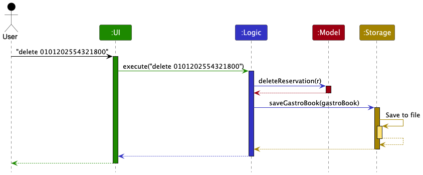
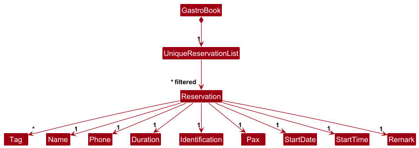
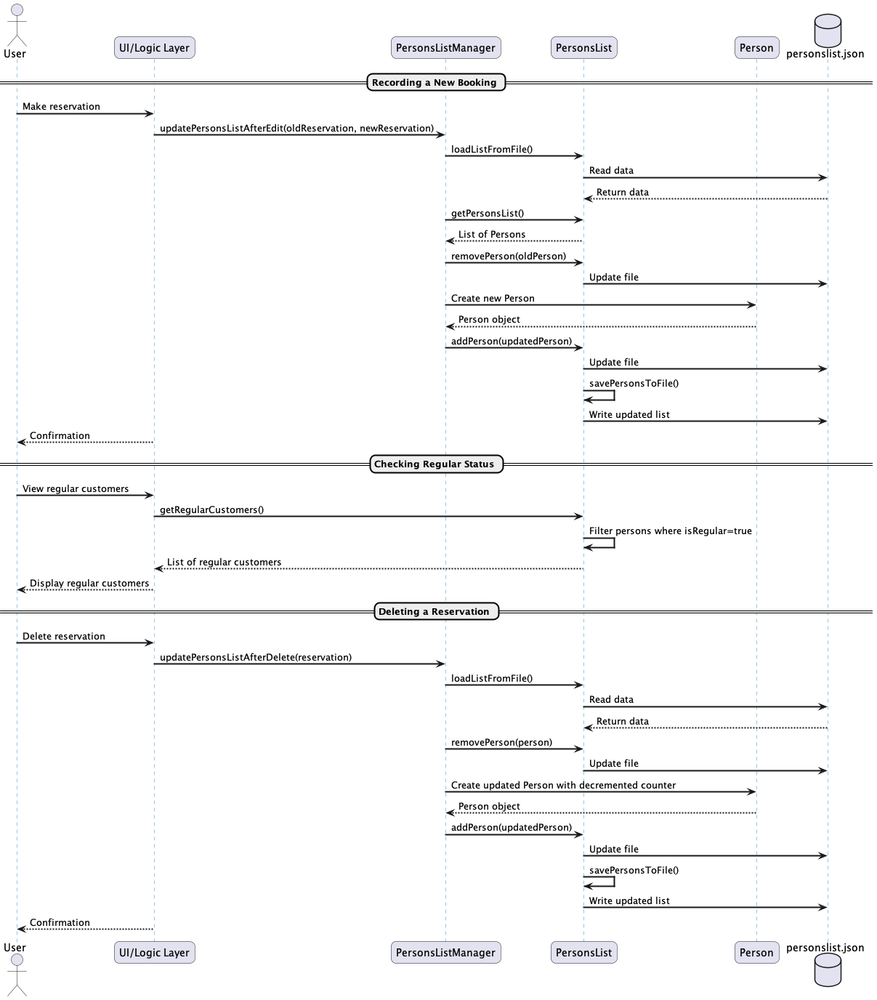
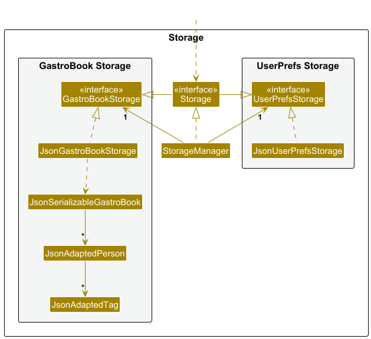

## Table of Contents

- [Acknowledgements](#acknowledgements)
- [Setting up, getting started](#setting-up-getting-started)
- [Design](#design)
    - [Architecture](#architecture)
    - [UI component](#ui-component)
    - [Logic component](#logic-component)
    - [Model component](#model-component)
    - [Storage component](#storage-component)
    - [Common classes](#common-classes)
- [Documentation, logging, testing, configuration, dev-ops](#documentation-logging-testing-configuration-dev-ops)
- [Appendix: Requirements](#appendix-requirements)
- [Appendix: Instructions for manual testing](#appendix-instructions-for-manual-testing)

--------------------------------------------------------------------------------------------------------------------

## **Acknowledgements**

* This project was adapted from [AB3](https://se-education.org/addressbook-level3/) (source code are provide [here](https://github.com/nus-cs2103-AY2425S2/tp))
* ChatGPT 4.0
* EPOS Systems
--------------------------------------------------------------------------------------------------------------------

## **Setting up, getting started**

Refer to the guide [_Setting up and getting started_](SettingUp.md).

--------------------------------------------------------------------------------------------------------------------

## **Design**

:bulb: **Tip:** The `.puml` files used to create diagrams in this document `docs/diagrams` folder. Refer to the [_PlantUML Tutorial_ at se-edu/guides](https://se-education.org/guides/tutorials/plantUml.html) to learn how to create and edit diagrams.

### Architecture

The ***Architecture Diagram*** given above explains the high-level design of the App.

Given below is a quick overview of main components and how they interact with each other.

**Main components of the architecture**

**`Main`** (consisting of classes [`Main`](https://github.com/AY2425S2-CS2103T-T09-3/tp/blob/master/src/main/java/seedu/address/Main.java) and [`MainApp`](https://github.com/AY2425S2-CS2103T-T09-3/tp/blob/master/src/main/java/seedu/address/MainApp.java) is in charge of the app launch and shut down.
* At app launch, it initializes the other components in the correct sequence, and connects them up with each other.
* At shut down, it shuts down the other components and invokes cleanup methods where necessary.

The bulk of the app's work is done by the following four components:

* [**`UI`**](#ui-component): The UI of the App.
* [**`Logic`**](#logic-component): The command executor.
* [**`Model`**](#model-component): Holds the data of the App in memory.
* [**`Storage`**](#storage-component): Reads data from, and writes data to, the hard disk.

[**`Commons`**](#common-classes) represents a collection of classes used by multiple other components.

**How the architecture components interact with each other**

The *Sequence Diagram* below shows how the components interact with each other for the scenario where the user issues the command `delete 0101202554321800`.

Each of the four main components (also shown in the diagram above),

* defines its *API* in an `interface` with the same name as the Component.
* implements its functionality using a concrete `{Component Name}Manager` class (which follows the corresponding API `interface` mentioned in the previous point.

For example, the `Logic` component defines its API in the `Logic.java` interface and implements its functionality using the `LogicManager.java` class which follows the `Logic` interface. Other components interact with a given component through its interface rather than the concrete class (reason: to prevent outside component's being coupled to the implementation of a component), as illustrated in the (partial) class diagram below.

The sections below give more details of each component.

### UI component

The **API** of this component is specified in [`Ui.java`](https://github.com/AY2425S2-CS2103T-T09-3/tp/blob/master/src/main/java/seedu/address/ui/Ui.java)

The UI consists of a `MainWindow` that is made up of parts e.g.`CommandBox`, `ResultDisplay`, `ReservationListPanel`, `StatusBarFooter` etc. All these, including the `MainWindow`, inherit from the abstract `UiPart` class which captures the commonalities between classes that represent parts of the visible GUI.

The `UI` component uses the JavaFx UI framework. The layout of these UI parts are defined in matching `.fxml` files that are in the `src/main/resources/view` folder. For example, the layout of the [`MainWindow`](https://github.com/AY2425S2-CS2103T-T09-3/tp/blob/master/src/main/java/seedu/address/ui/MainWindow.java) is specified in [`MainWindow.fxml`](https://github.com/AY2425S2-CS2103T-T09-3/tp/blob/master/src/main/resources/view/MainWindow.fxml)

The `UI` component,

* executes user commands using the `Logic` component.
* listens for changes to `Model` data so that the UI can be updated with the modified data.
* keeps a reference to the `Logic` component, because the `UI` relies on the `Logic` to execute commands.
* depends on some classes in the `Model` component, as it displays `Person` object residing in the `Model`.

### Logic component

**API** : [`Logic.java`](https://github.com/AY2425S2-CS2103T-T09-3/tp/blob/master/src/main/java/seedu/address/logic/Logic.java)

Here's a (partial) class diagram of the `Logic` component:

The sequence diagram below illustrates the interactions within the `Logic` component, taking `execute("delete 0604202598761700")` API call as an example.

:information_source: **Note:** The lifeline for `DeleteCommandParser` should end at the destroy marker (X) but due to a limitation of PlantUML, the lifeline continues till the end of diagram.

How the `Logic` component works:

1. When `Logic` is called upon to execute a command, it is passed to an `GastroBookParser` object which in turn creates a parser that matches the command (e.g., `DeleteCommandParser`) and uses it to parse the command.
2. This results in a `Command` object (more precisely, an object of one of its subclasses e.g., `DeleteCommand`) which is executed by the `LogicManager`.
3. The command can communicate with the `Model` when it is executed (e.g. to delete a person). 
   Note that although this is shown as a single step in the diagram above (for simplicity), in the code it can take several interactions (between the command object and the `Model`) to achieve.
4. The result of the command execution is encapsulated as a `CommandResult` object which is returned back from `Logic`.

Here are the other classes in `Logic` (omitted from the class diagram above) that are used for parsing a user command:

How the parsing works:
* When called upon to parse a user command, the `GastroBookParser` class creates an `XYZCommandParser` (`XYZ` is a placeholder for the specific command name e.g., `AddCommandParser`) which uses the other classes shown above to parse the user command and create a `XYZCommand` object (e.g., `AddCommand`) which the `GastroBookParser` returns back as a `Command` object.
* All `XYZCommandParser` classes (e.g., `AddCommandParser`, `DeleteCommandParser`, ...) inherit from the `Parser` interface so that they can be treated similarly where possible e.g, during testing.

### Model component
**API** : [`Model.java`](https://github.com/AY2425S2-CS2103T-T09-3/tp/blob/master/src/main/java/seedu/address/model/Model.java)

Below is the diagram that shows the high level design of `Model` component.

The `Model` component,

* stores the GastroBook data i.e., all `Reservation` objects (which are contained in a `UniqueReservationList` object).
* stores the customer data. i.e., all `Person` objects (which are contained in a `PersonsList` object).
* stores a `PersonsListManager` object. It manages operations related to `PersonsList` object that involve coordination with `Reservation` objects.
* stores the currently 'selected' `Reservation` objects (e.g., results of a search query) as a separate _filtered_ list which is exposed to outsiders as an unmodifiable `ObservableList<Reservation>` that can be 'observed' e.g. the UI can be bound to this list so that the UI automatically updates when the data in the list change.(not shown in the diagram as it is lower level details)
* stores a `UserPref` object that represents the user's preferences. This is exposed to the outside as a `ReadOnlyUserPref` objects.
* does not depend on any of the other three components (as the `Model` represents data entities of the domain, they should make sense on their own without depending on other components)

:information_source: **Note:** A more detailed extension for `GastroBook` and `PersonList` UML diagram in `Model` component is given below.   

  

 
 

  

The `PersonsList` class and related components manage customers who have made reservations, tracking their booking frequency and regular customer status.

:information_source: **Note:** An interaction between `PersonsList` and `PersonsListManager` in `Model` component is given as sequence diagram below.

   

This sequence diagram illustrates three key operations:  
1. **Recording a new booking** - handling reservation edits and updating person records  
2. **Checking regular status** - identifying customers who have reached regular status  
3. **Deleting a reservation** - updating customer records when a reservation is canceled   

**Key Features:**  
- Regular customer tracking based on booking frequency  
- Persistence through JSON file storage  
- Coordination with the reservation system for consistent data  

### Storage component

**API** : [`Storage.java`](https://github.com/AY2425S2-CS2103T-T09-3/tp/blob/master/src/main/java/seedu/address/storage/Storage.java)

The `Storage` component,
* can save both address book data and user preference data in JSON format, and read them back into corresponding objects.
* inherits from both `GatroBookStorage` and `UserPrefStorage`, which means it can be treated as either one (if only the functionality of only one is needed).
* depends on some classes in the `Model` component (because the `Storage` component's job is to save/retrieve objects that belong to the `Model`)
* storage of `PersonsList` files and data are implemented under `Model`.

### Common classes

Classes used by multiple components are in the `seedu.address.commons` package.
--------------------------------------------------------------------------------------------------------------------

[//]: # ()
[//]: # (## **Implementation**)

[//]: # ()
[//]: # (This section describes some noteworthy details on how certain features are implemented.)

[//]: # ()
[//]: # (### \[Proposed\] Undo/redo feature)

[//]: # ()
[//]: # (#### Proposed Implementation)

[//]: # ()
[//]: # (The proposed undo/redo mechanism is facilitated by `VersionedAddressBook`. It extends `AddressBook` with an undo/redo history, stored internally as an `addressBookStateList` and `currentStatePointer`. Additionally, it implements the following operations:)

[//]: # ()
[//]: # (* `VersionedAddressBook#commit&#40;&#41;` — Saves the current address book state in its history.)

[//]: # (* `VersionedAddressBook#undo&#40;&#41;` — Restores the previous address book state from its history.)

[//]: # (* `VersionedAddressBook#redo&#40;&#41;` — Restores a previously undone address book state from its history.)

[//]: # ()
[//]: # (These operations are exposed in the `Model` interface as `Model#commitAddressBook&#40;&#41;`, `Model#undoAddressBook&#40;&#41;` and `Model#redoAddressBook&#40;&#41;` respectively.)

[//]: # ()
[//]: # (Given below is an example usage scenario and how the undo/redo mechanism behaves at each step.)

[//]: # ()
[//]: # (Step 1. The user launches the application for the first time. The `VersionedAddressBook` will be initialized with the initial address book state, and the `currentStatePointer` pointing to that single address book state.)

[//]: # ()
[//]: # (![UndoRedoState0]&#40;images/UndoRedoState0.png&#41;)

[//]: # ()
[//]: # (Step 2. The user executes `delete 5` command to delete the 5th person in the address book. The `delete` command calls `Model#commitAddressBook&#40;&#41;`, causing the modified state of the address book after the `delete 5` command executes to be saved in the `addressBookStateList`, and the `currentStatePointer` is shifted to the newly inserted address book state.)

[//]: # ()
[//]: # (![UndoRedoState1]&#40;images/UndoRedoState1.png&#41;)

[//]: # ()
[//]: # (Step 3. The user executes `add n/David …​` to add a new person. The `add` command also calls `Model#commitAddressBook&#40;&#41;`, causing another modified address book state to be saved into the `addressBookStateList`.)

[//]: # ()
[//]: # (![UndoRedoState2]&#40;images/UndoRedoState2.png&#41;)

[//]: # ()
[//]: # (
:information_source: **Note:** If a command fails its execution, it will not call `Model#commitAddressBook&#40;&#41;`, so the address book state will not be saved into the `addressBookStateList`.)

[//]: # ()
[//]: # (
)

[//]: # ()
[//]: # (Step 4. The user now decides that adding the person was a mistake, and decides to undo that action by executing the `undo` command. The `undo` command will call `Model#undoAddressBook&#40;&#41;`, which will shift the `currentStatePointer` once to the left, pointing it to the previous address book state, and restores the address book to that state.)

[//]: # ()
[//]: # (![UndoRedoState3]&#40;images/UndoRedoState3.png&#41;)

[//]: # ()
[//]: # (
:information_source: **Note:** If the `currentStatePointer` is at index 0, pointing to the initial AddressBook state, then there are no previous AddressBook states to restore. The `undo` command uses `Model#canUndoAddressBook&#40;&#41;` to check if this is the case. If so, it will return an error to the user rather)

[//]: # (than attempting to perform the undo.)

[//]: # ()
[//]: # (
)

[//]: # ()
[//]: # (The following sequence diagram shows how an undo operation goes through the `Logic` component:)

[//]: # ()
[//]: # (![UndoSequenceDiagram]&#40;images/UndoSequenceDiagram-Logic.png&#41;)

[//]: # ()
[//]: # (
:information_source: **Note:** The lifeline for `UndoCommand` should end at the destroy marker &#40;X&#41; but due to a limitation of PlantUML, the lifeline reaches the end of diagram.)

[//]: # ()
[//]: # (
)

[//]: # ()
[//]: # (Similarly, how an undo operation goes through the `Model` component is shown below:)

[//]: # ()
[//]: # (![UndoSequenceDiagram]&#40;images/UndoSequenceDiagram-Model.png&#41;)

[//]: # ()
[//]: # (The `redo` command does the opposite — it calls `Model#redoAddressBook&#40;&#41;`, which shifts the `currentStatePointer` once to the right, pointing to the previously undone state, and restores the address book to that state.)

[//]: # ()
[//]: # (
:information_source: **Note:** If the `currentStatePointer` is at index `addressBookStateList.size&#40;&#41; - 1`, pointing to the latest address book state, then there are no undone AddressBook states to restore. The `redo` command uses `Model#canRedoAddressBook&#40;&#41;` to check if this is the case. If so, it will return an error to the user rather than attempting to perform the redo.)

[//]: # ()
[//]: # (
)

[//]: # ()
[//]: # (Step 5. The user then decides to execute the command `list`. Commands that do not modify the address book, such as `list`, will usually not call `Model#commitAddressBook&#40;&#41;`, `Model#undoAddressBook&#40;&#41;` or `Model#redoAddressBook&#40;&#41;`. Thus, the `addressBookStateList` remains unchanged.)

[//]: # ()
[//]: # (![UndoRedoState4]&#40;images/UndoRedoState4.png&#41;)

[//]: # ()
[//]: # (Step 6. The user executes `clear`, which calls `Model#commitAddressBook&#40;&#41;`. Since the `currentStatePointer` is not pointing at the end of the `addressBookStateList`, all address book states after the `currentStatePointer` will be purged. Reason: It no longer makes sense to redo the `add n/David …​` command. This is the behavior that most modern desktop applications follow.)

[//]: # ()
[//]: # (![UndoRedoState5]&#40;images/UndoRedoState5.png&#41;)

[//]: # ()
[//]: # (The following activity diagram summarizes what happens when a user executes a new command:)

[//]: # ()
[//]: # ()

[//]: # ()
[//]: # (#### Design considerations:)

[//]: # ()
[//]: # (**Aspect: How undo & redo executes:**)

[//]: # ()
[//]: # (* **Alternative 1 &#40;current choice&#41;:** Saves the entire address book.)

[//]: # (  * Pros: Easy to implement.)

[//]: # (  * Cons: May have performance issues in terms of memory usage.)

[//]: # ()
[//]: # (* **Alternative 2:** Individual command knows how to undo/redo by)

[//]: # (  itself.)

[//]: # (  * Pros: Will use less memory &#40;e.g. for `delete`, just save the person being deleted&#41;.)

[//]: # (  * Cons: We must ensure that the implementation of each individual command are correct.)

[//]: # ()
[//]: # (_{more aspects and alternatives to be added}_)

[//]: # ()
[//]: # (### \[Proposed\] Data archiving)

[//]: # ()
[//]: # (_{Explain here how the data archiving feature will be implemented}_)

--------------------------------------------------------------------------------------------------------------------

## **Documentation, logging, testing, configuration, dev-ops**

* [Documentation guide](Documentation.md)
* [Testing guide](Testing.md)
* [Logging guide](Logging.md)
* [Configuration guide](Configuration.md)
* [DevOps guide](DevOps.md)

--------------------------------------------------------------------------------------------------------------------

## **Appendix: Requirements**

### Product scope

### **Target User Profile**

* **Type**: F&B/restaurant managers and staff
* **Proficiency**: Comfortable using Command-Line Interface (CLI) apps
* **Needs**:
    * Ability to manage a large number of reservations
    * Speed and efficiency with typing, prefers keyboard over mouse
    * Streamlined reservation management to ensure smooth operations
* **Environment**: Works in a fast-paced restaurant environment where reservations and customer service are key

### **Value Proposition**

GastroBook streamlines and collates restaurant reservations, allowing managers to efficiently manage customer bookings, track reservation details, and handle special requests through a fast, command-line interface. The application improves reservation workflow, enhances operational efficiency, and allows for better resource planning.

### User stories

Priorities: High (must have) - `* * *`, Medium (nice to have) - `* *`, Low (unlikely to have) - `*`

| **Priority** | **As a …​** | **I want to …​**                            | **So that I can…​**                                                           |
|--------------|-------------|---------------------------------------------|-------------------------------------------------------------------------------|
| `***`        | Admin       | Add reservations                            | Add bookings to the schedule for planning                                     |
| `***`        | Admin       | Delete reservations                         | Cancel a reservation when no longer needed                                    |
| `***`        | Admin       | Mark a reservation as paid                  | Keep track of each reservation’s payment status                               |
| `***`        | Admin       | Unmark a reservation as paid                | Update status if payment is deleted or an error occurred                      |
| `***`        | Admin       | Exit the application                        | Close the app after use                                                       |
| `***`        | Admin       | Edit reservation details                    | Update booking details (e.g., name, duration) without deleting and recreating |
| `***`        | Admin       | View all reservations of tomorrow           | Prepare the ingredients for tomorrow reservation in advance                   |
| `***`        | Admin       | View all reservations of today              | Access the daily reservation schedule for planning resources                  |
| `***`        | Admin       | View all reservations of today and tomorrow | Be always ready and prepare to welcome incoming guest                         |
| `**`         | Admin       | View all past reservations                  | Track reservations for business insights                                      |
| `**`         | Admin       | View reservations by regulars               | Better prepare for reservations made by regulars                              |
| `***`        | Admin       | See user manual                             | Learn the new app effectively                                                 |
| `**`         | Admin       | Find specific reservations                  | Locate specific reservations by name, phone number or time                    |
| `**`         | Admin       | Tag reservations with special requests      | Easily track special requests per reservation                                 |
| `**`         | Admin       | Remark reservations                         | Further customise and tailor each reservation to customer needs               |
| `**`         | Admin       | Clear all reservations                      | Reset the schedule for a new reservation plan                                 |

*{More to be added}*

### Use cases

For all use cases below:  
**System**: `GastroBook`  
**Actor**: `admin`  
unless specified otherwise

### **U1: Add a reservation**

**MSS** (Main Success Scenario)
1. User inputs reservation details (name, phone, date, time, duration, number of people, table number, tags). 
2. System adds the reservation to the schedule. 
3. System displays a successful reservation message. 

Use case ends.

**Extensions**  
1a. User input invalid parameters. 
&ensp; 1a1. System indicates input parameters are invalid and shows the correct example of use.  
&ensp; Use case resumes at step 1. 

2a. The reservation has existed in the system. 
&ensp; 2a1. System indicates that the reservation already exists in the GastroBook.  
&ensp; Use case resumes at step 1.

---

### **U2: Delete a reservation**

**MSS**
1. User inputs the reservation they want to cancel.
2. System removes the reservation from the schedule.
3. System displays a successful cancellation message.

Use case ends.

**Extensions**  
1a. The user inputs invalid parameters or invalid command.  
&ensp; 1a1. System displays an error message.  
&ensp; Use case resumes at step 1.

2a. The reservation does not exist.  
&ensp; 2a1. System displays an error message.  
&ensp; Use case resumes at step 1.

---

### **U3: Mark a reservation as paid**

**MSS**
1. User inputs the reservation they want to mark as paid.
2. System updates the reservation's payment status as paid.
3. System display a message indicating the reservation has been successfully marked

Use case ends.

**Extensions**  
1a. User types in invalid command.  
&ensp; 1a1. System displays an error message.  
&ensp; Use case resumes at step 1.  

2a. The reservation does not exist.  
&ensp; 2a1. System displays an error message.  
&ensp; Use case resumes at step 1.  

2b. The reservation has already been marked as paid.  
&ensp; 2b1. System indicates that reservation has already been marked as paid.  
&ensp; Use case resumes at step1.

---

### **U4: Mark a reservation as unpaid (Unmark)**

**MSS**
1. User inputs the reservation they want to mark as unpaid.
2. System updates the reservation's payment status as unpaid.
3. System display a message indicating the reservation has been successfully unmarked.

Use case ends.

**Extensions**  
1a. User types in invalid command.  
&ensp; 1a1. System displays an error message.  
&ensp; Use case resumes at step 1.

2a. The reservation does not exist.  
&ensp; 2a1. System displays an error message.  
&ensp; Use case resumes at step 1.

2b. The reservation has already been marked as unpaid.  
&ensp; 2b1. System indicates that reservation has already been marked as unpaid.  
&ensp; Use case resumes at step1.

---
### **U5: Exit the application**

**MSS**
1. User inputs exit command.
2. System saves all changes into storage.
3. System exits.

Use case ends.

---
### **U6: Find a reservation by name**

**MSS**
1. User finds the reservation by name.
2. System displays all reservations that are made under the queried name.

Use case ends.

**Extensions**  
1a. The user enters invalid command format.  
&ensp; 1a1. System displays an error message.  
&ensp; Use case resumes at step 1.

1b. The user enters an invalid phone number. 
&ensp; 1b1. System displays an error message.  
&ensp; Use case resumes at step 1.

2a. The name does not exist.  
&ensp; 2a1. System displays an error message.  
&ensp; Use case resumes at step 1.

---
### **U7: Find a reservation by phone**

**MSS**
1. User finds the reservation by phone.
2. System displays all reservations that are made under the queried phone number.

Use case ends.

**Extensions**  
1a. The user enters invalid command format.  
&ensp; 1a1. System displays an error message.  
&ensp; Use case resumes at step 1.

1b. The user enters an invalid phone number. 
&ensp; 1b1. System displays an error message.  
&ensp; Use case resumes at step 1.

2a. The user enters a phone number that does not exist.  
&ensp; 2a1. System displays no matching reservations message.  
&ensp; Use case resumes at step 1.

---
### **U8: Find a reservation by time**

**MSS**
1. User finds the reservation by time.
2. System displays all reservations that are ongoing at specified time.

Use case ends.

**Extensions**  
1a. The user enters invalid command format.  
&ensp; 1a1. System displays an error message.  
&ensp; Use case resumes at step 1.

2a. The user enters a time with no ongoing reservations.  
&ensp; 2a1. System displays no matching reservations message.  
&ensp; Use case resumes at step 1.

---
### **U9: List all reservations for the day**

**MSS**
1. User queries to list all reservations for the day
2. System displays all reservations that are made on the system date.

Use case ends.

**Extensions**  
1a. The user enters invalid command format.  
&ensp; 1a1. System displays an error message.  
&ensp; Use case resumes at step 1.

---
### **U10: Edit specific reservations**

**MSS**
1. User queries to edit the reservation with ID.
2. System edit the reservation.
3. System displays all reservations for today and tomorrow with a reservation edited message.

Use case ends.

**Extensions**  
1a. Reservation is not for today or tomorrow.  
&ensp; 1a1. System displays reservation not found message.  
&ensp; Use case resumes at step 1.

1b. Reservation ID is invalid.  
&ensp; 1b1. System displays an invalid command message and provides an example of correct edit usage.  
&ensp; Use case resumes at step 1.

1c. User doesn't provide at least one field to edit.  
&ensp; 1c1. System displays error message.  
&ensp; Use case resumes at step 1.

2a. User tries to edit the phone number, time or date of the reservation.  
&ensp; 2a1. System generates a new reservation ID based on the updated info.  
&ensp; 2a2. System checks if the new reservation ID already exists.  
&ensp; - if it exists:  
&ensp; System displays an error message.  
&ensp; Use case resumes at step 1.  

&ensp; - if it does not exists:  
&ensp; System edits the reservation.  
&ensp; Use case resumes at step 3.

2b. The reservation does not exist.  
&ensp; 2b1. System display reservation not exist message.  
&ensp; Use case resumes at step 1.

---
### **U11: Add remark to a reservation**

**MSS**
1. User queries to remark the reservation with valid ID.
2. System updates or adds the remark to the reservation.

Use case ends.

**Extensions**  
1a. Reservations to be remarked queried with ID that does not exist.  
&ensp; 1a1. System displays an error message.   
&ensp; Use case resumes at step 1.

1b. Reservation to be remarked queried with invalid ID.  
&ensp; 1b1. System displays an error message and output correct use of remark command.   
&ensp; Use case resumes at step 1.

---

### Non-Functional Requirements

1. **Platform Compatibility**: The application must run on any mainstream OS (Windows, Linux, macOS) with Java 17 or above.
2. **Performance**: The system should handle up to 1000 reservations without noticeable performance degradation during typical usage.
3. **Usability**: A user with above-average typing speed for regular English text should be able to accomplish key tasks faster using the command-line interface than a GUI-based app.
4. **Response Time**: The system should respond to commands within 1 second for typical tasks such as adding, editing, or deleting reservations.
5. **Storage**: The system storage should be able to store and maintain at least 100 reservations with all necessary details.
6. **Storage Access**: The system should be able to retrieve data with the given storage requirements in under 1 second.
7. **User Access**: The system should be able to run locally with no more than 1 user with 1 database.
8. **Phone Number**: Last 4 digits of phone number of every customer input to the system must be of unique combination.
9. **Customisation**: Threshold for a customer becoming a regular customer is hardcoded. (3 currently)
     9.1 **All fields are fixed**
10. **Clearing**: All customer details in persons list will preserve even after clear function.
11. **Duplicate Reservations**: Duplicate reservations are not allowed to be added into the database. Reservations are considered to be duplicates only if:  
    &ensp; - The last 4 digit of the phone numbers of both reservations are the same  
    &ensp; - The booking date of both reservations are the same  
    &ensp; - The booking time of both reservations are the same  
    &ensp;The above situation is unlikely to happen(<0.001%).
12. **Time**: The time of reservations is not limited and is subjected to user discretion.
    &ensp; - No earliest or latest time limit placed (e.g. 0000 is also allowed)
    &ensp; - Reservations before current time are allowed (e.g. reservation at 1400 today can be made even if current time is 1600)
13. **Duration**: The duration of reservations must be <12h and are in intervals of 30 minutes or 1 hour.
14. **Pax**: Number of people per reservation is not limited and is subjected to user discretion.
15. **Table Number**: Table number assigned to each reservation is subjected to user discretion.

*{More to be added}*

### Glossary

* **Mainstream OS**: Windows, Linux, Unix, MacOS
* **Reservation ID**: A unique identifier (e.g., 0204202598761300) assigned to each reservation.
* **CLI (Command-Line Interface)**: A text-based interface that allows users to interact with the system using typed commands.
* **Valid Command**: A command that the system recognizes and processes correctly.
* **Invalid Command**: A command that is unrecognized or improperly formatted by the system.
* **Valid ID**: The id for which edit, mark, unmark, delete, remark take as parameter which has a form of "[dateOfTodayOrTomorrow(ddMMyyyy)] + [UNIQUE last4DigitsOfPhoneNumber(xxxx)] + [time(HHMM)]".
* **Valid Phone Number**: A phone number that has at least 4 digits.
* **Valid Table Number**: A table number that starts with a capital letter, followed by 1-3 numbers.
* **Regular**: A customer will be classified as a Regular if their phone number has been used to successfully make at least three reservations.As long as the phone number is the same, the reservation count will be incremented regardless of other customer information.
--------------------------------------------------------------------------------------------------------------------

## **Appendix: Instructions for manual testing**

Given below are instructions to test the app manually.

:information_source: **Note:** 

1. Testers should not modify the JSON file directly, as doing so may cause errors.

### Launch and shutdown

1. Initial launch

   1. Download the jar file and copy into an empty folder

2. Saving window preferences

   1. Resize the window to an optimum size. Move the window to a different location. Close the window.

   2. Re-launch the app by double-clicking the jar file. 
       Expected: The most recent window size and location is retained.

3. _{ more test cases …​ }_

### Deleting a reservation

1. Deleting a reservation while all reservations are being shown

   1. Prerequisites: List all reservations of today or tomorrow using the `list` command. Multiple reservations in the list.

   1. Test case: `delete 0101202512341100` 
      Expected: Reservation with ID 0101202512341100 is deleted from the list. Details of the deleted reservation shown in the status message. Timestamp in the status bar is updated.

   1. Test case: `delete 0` 
      Expected: No reservation is deleted. Error details shown in the status message. Status bar remains the same.

   1. Other incorrect delete commands to try: `delete`, `delete x`, `...` (where x is larger than the list size) 
      Expected: Similar to previous.

1. _{ more test cases …​ }_

### Saving data

1. Dealing with missing/corrupted data files

   1. _{explain how to simulate a missing/corrupted file, and the expected behavior}_

1. _{ more test cases …​ }_
