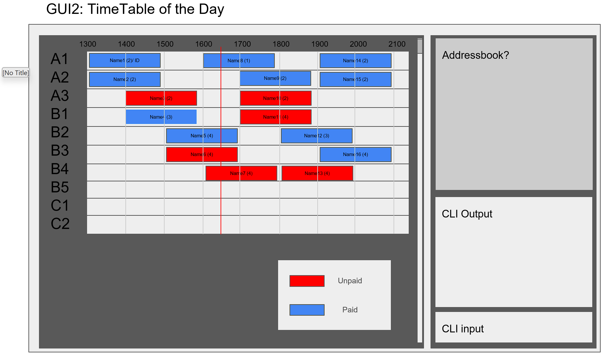

# GastroBook User Guide

GastroBook is a **desktop app for managing restaurant reservations for small scale resturants who are only taking reservations for current day and next day, optimized for use via a Command Line Interface** (CLI) while still having the benefits of a Graphical User Interface (GUI).

* Table of Contents
  {:toc}

--------------------------------------------------------------------------------------------------------------------

## Quick start

1. Ensure you have Java `17` or above installed in your Computer. 
   **Mac users:** Ensure you have the precise JDK version prescribed [here](https://se-education.org/guides/tutorials/javaInstallationMac.html).

1. Download the latest `.jar` file from our website.

1. Copy the file to the folder you want to use as the _home folder_ for your GastroBook.

1. Open a command terminal, `cd` into the folder you put the jar file in, and use the `java -jar gastrobook.jar` command to run the application. 
   A GUI similar to the below should appear in a few seconds. Note how the app contains some sample reservation data. 
   

1. Type the command in the command box and press Enter to execute it. e.g. typing **`help`** and pressing Enter will open the help window. 
   Some example commands you can try:

    * `list` : Lists all reservations.

    * `add n/John Doe p/98765432 date/01/03/2025 time/1800 duration/2 pax/2 table/A1 t/regular t/event ` : Adds a reservation for `John Doe` to GastroBook.

    * `delete 170320259344` : Deletes the reservation with ID 170320259344.

    * `listrt` : Lists all reservations for today.

    * `exit` : Exits the app.

    * `edit [validReservationID] n/John Doe p/98765432 date/01/03/2025 time/1800 duration/2 pax/2 table/A1 t/regular t/event ` : Edit tomorrow or today reservations details.

1. Refer to the [Features](#features) below for details of each command.

--------------------------------------------------------------------------------------------------------------------

### Viewing help : `help`

Shows a link to guide you to a help page.

Format: `help`

### Adding a reservation: `add`

Adds a reservation to GastroBook.

Format: `add n/[NAME] p/[PHONE_NUMBER] date/[DATE] time/[TIME] duration/[DURATION] pax/[NUMBER_OF_PEOPLE] table/[TABLE_NUMBER] t/[TAG_1] t/[TAG_2] `

* NAME: Name of the person making the reservation (string)
* PHONE_NUMBER: Contact number of the person making the reservation
* DATE: Date of reservation in DD/MM/YYYY format (e.g., 01/03/2025 for March 1, 2025)
* TIME: Time of reservation in 24-hour HHMM format (e.g., 1800 for 6:00 PM)
* DURATION: Duration of reservation in hours (maximum 2 hours)
* NUMBER_OF_PEOPLE: Number of people for the reservation (integer)
* TABLE_NUMBER: Assigned table number/code for the reservation
* TAG: tags to categorize the reservation (e.g., regular, event, birthday)

Examples:
* `add n/John Doe p/98765432 date/01/03/2025 time/1800 duration/2 pax/2 table/A1 t/regular t/event`

### Editing a reservation: `edit`

Edits the reservation with the specified `RESERVATION_ID`.

Format: `edit [RESERVATION_ID] n/[NAME] p/[PHONE_NUMBER] date/[DATE] time/[TIME] duration/[DURATION] pax/[NUMBER_OF_PEOPLE] table/[TABLE_NUMBER] t/[TAG_1] t/[TAG_2] `

* RESERVATION_ID: Identifier combining today's or tomorrow's date (DDMMYYYY) with the unique last 4 digits of the customer's phone number and time of reservation in HHMM format (e.g., 1803202512341200 for a booking on March 18, 2025 at 1200, with phone ending in 1234).
* NAME: Name of the person making the reservation (string)
* PHONE_NUMBER: Contact number of the person making the reservation
* DATE: Date of reservation in DD/MM/YYYY format (e.g., 01/03/2025 for March 1, 2025)
* TIME: Time of reservation in 24-hour HHMM format (e.g., 1800 for 6:00 PM)
* DURATION: Duration of reservation in hours (maximum 2 hours)
* NUMBER_OF_PEOPLE: Number of people for the reservation (integer)
* TABLE_NUMBER: Assigned table number/code for the reservation
* TAG: tags to categorize the reservation (e.g., regular, event, birthday)
* REMARK: Additional information that is tied to the reservation

Examples:
* `edit 180320251234 n/John Doe p/98761234 date/18/03/2025 time/1800 duration/2 pax/2 table/A1 t/regular t/event`

### Listing all reservations : `list`

Shows a list of all reservations in GastroBook, sorted by date and time.

Format: `list`

### Listing today's reservations : `listrt`

Shows a list of all reservations for today, sorted by time.

Format: `listrt`

### Listing tomorrow's reservations : `listrn`

Shows a list of all reservations for tomorrow, sorted by time.

Format: `listrn`

### Finding reservations by name: `findn`

Finds reservations by name.

Format: `findn [NAME]`

* The search is case-insensitive. e.g., `findn john doe` will match `John Doe`

Examples:
* `findn John` returns all reservations made by John.
* `findn Jane` returns all reservations made by Jane.
* `findn John Jane` returns all reservations made by John or Jane.

### Finding reservations by phone number: `findp`

Finds reservations by phone number.

Format: `findp [PHONE_NUMBER]`

* Partial phone numbers will not be accepted. e.g., `9123` will not match `91234567`

Examples:
* `findp 98765432` returns all reservations made by the person with phone number 98765432.
* `findp 91234567 98765432` returns all reservations made by the people with phone numbers 91234567 and 98765432.

### Deleting a reservation : `delete`

Deletes a specific reservation from GastroBook.

Format: `delete [RESERVATION_ID]`

* Deletes the reservation with the specified `RESERVATION_ID`.
* The reservation ID is in the format: date of reservation followed by his/her phone number and the time of reservation (e.g., 1703202593441200).

Examples:
* `delete 1703202593441200` deletes the reservation with ID 1703202593441200.

### Marking a reservation as paid : `mark`

Marks a specific reservation as paid.

Format: `mark [RESERVATION_ID]`

* Marks the reservation with the specified `RESERVATION_ID` as paid.
* The reservation ID is in the format: date of reservation followed by his/her phone number and the time of reservation (e.g., 1703202593441200).

Examples:
* `mark 1703202593441200` marks the reservation with ID 1703202593441200 as paid.

### Unmarking a reservation as paid : `unmark`

Marks a specific reservation as unpaid.

Format: `unmark [RESERVATION_ID]`

* Marks the reservation with the specified `RESERVATION_ID` as unpaid.
* The reservation ID is in the format: date of reservation followed by his/her phone number and the time of reservation (e.g., 1703202593441200).

Examples:
* `unmark 1703202593441200` marks the reservation with ID 1703202593441200 as unpaid.

### Exiting the program : `exit`

Exits the program.

Format: `exit`

### Saving the data

GastroBook data are saved in the hard disk automatically after any command that changes the data. There is no need to save manually.

### Editing the data file

GastroBook data are saved automatically as a JSON file `[JAR file location]/data/addressbook.json`.

--------------------------------------------------------------------------------------------------------------------

## Command summary

| Action                   | Format, Examples                                                                                                                                                                                                                                                   |
|--------------------------|--------------------------------------------------------------------------------------------------------------------------------------------------------------------------------------------------------------------------------------------------------------------|
| **Add**                  | `add n/NAME p/PHONE_NUMBER date/DATE time/TIME duration/DURATION pax/NUMBER_OF_PEOPLE table/TABLE_NUMBER [t/TAG]…`   e.g., `add n/John Doe p/98765432 date/01/03/2025 time/1800 duration/2 pax/2 table/A1 t/regular t/event`                                    |
| **Edit**                 | `edit RESERVATION_ID n/NAME p/PHONE_NUMBER date/DATE time/TIME duration/DURATION pax/NUMBER_OF_PEOPLE table/TABLE_NUMBER [t/TAG]...`   e.g.,`edit 1803202512341200 n/John Doe p/98761234 date/18/03/2025 time/1800 duration/2 pax/2 table/A1 t/regular t/event` |
| **Delete**               | `delete RESERVATION_ID`  e.g., `delete 1703202593441200`                                                                                                                                                                                                        |
| **Mark**                 | `mark RESERVATION_ID`  e.g., `mark 1703202593441200`                                                                                                                                                                                                            |
| **Unmark**               | `unmark RESERVATION_ID`  e.g., `unmark 1703202593441200`                                                                                                                                                                                                        |
| **Find by name**         | `findn NAME`  e.g., `findn John Doe`                                                                                                                                                                                                                            | |
| **Find by phone number** | `findp PHONE_NUMBER`  e.g., `findp 91234567`                                                                                                                                                                                                                    |
| **List all**             | `list`                                                                                                                                                                                                                                                             |
| **List today**           | `listrt`                                                                                                                                                                                                                                                           |
| **List tomorrow**        | `listrn`                                                                                                                                                                                                                                                           |
| **Help**                 | `help`                                                                                                                                                                                                                                                             |
| **Exit**                 | `exit`                                                                                                                                                                                                                                                             |
|
