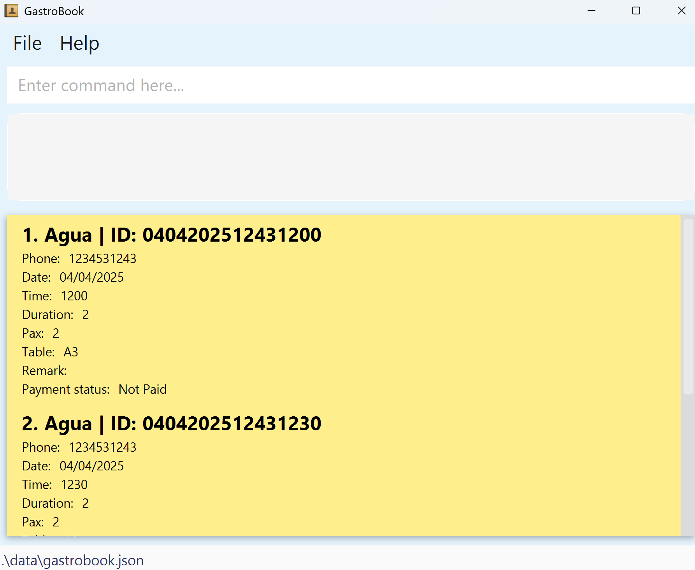

* Table of Contents
  {:toc}

--------------------------------------------------------------------------------------------------------------------

## Introduction

GastroBook is a **desktop app for managing restaurant reservations for small scale restaurants who are only taking reservations for current day and next day, optimized for use via a Command Line Interface** (CLI) while still having the benefits of a Graphical User Interface (GUI).

--------------------------------------------------------------------------------------------------------------------

## **Quick start**

1. Ensure you have Java `17` or above installed in your Computer. 
   **Mac users:** Ensure you have the precise JDK version prescribed [here](https://se-education.org/guides/tutorials/javaInstallationMac.html).

2. Download the latest `.jar` file from our website.

3. Copy the file to the folder you want to use as the _home folder_ for your GastroBook.

4. Open a command terminal, `cd` into the folder you put the jar file in, and use the `java -jar gastrobook.jar` command to run the application. 
   A GUI similar to the below should appear in a few seconds. Note how the app contains some sample reservation data. 
   

5. Type the command in the command box and press Enter to execute it. e.g. typing **`help`** and pressing Enter will open the help window. 
   Some example commands you can try:

   * `list` : Lists all reservations for today and tomorrow.

   * `add n/John Doe p/98765432 date/01/03/2025 time/1800 duration/2 pax/2 table/A1 t/birthday ` : Adds a reservation for `John Doe` to GastroBook.

   * `delete [validReservationID (ie: 1703202593441230)]` : Deletes the reservation with ID 1703202593441230.

   * `listrt` : Lists all reservations for today.

   * `exit` : Exits the app.

   * `edit [validReservationID (ie: 1703202593441230)] n/John Doe p/98765432 date/01/03/2025 time/1800 duration/2 pax/2 table/A1 t/regular t/event ` : Edit corresponding reservation with the new details.

6. Refer to the [Features](#features) below for details of each command.

--------------------------------------------------------------------------------------------------------------------

## Input Field Table

| **Field**          | **Example**           | **Description**                                                                      |
|--------------------|-----------------------|--------------------------------------------------------------------------------------|
| `NAME`             | n/John                | Name of the person making the reservation                                            |
| `PHONE_NUMBER`     | p/98765432            | Contact number of the person                                                         |
| `DATE`             | date/01/04/2025       | Date of reservation (e.g., `01/03/2025`)                                             |
| `TIME`             | time/1200             | Time of reservation in 24-hour format (e.g., `1800` for 6:00 PM)                     |
| `DURATION`         | duration/2            | Duration in hours (maximum 12.0 hours)                                               |
| `NUMBER_OF_PEOPLE` | pax/2                 | Number of people included in the reservation                                         |
| `TABLE_NUMBER`     | table/A1              | Assigned table number or code in the form of 1 capital letter followed by 1-3 digits |
| `REMARK`           | r/Allergic to Peanuts | Any additional remarks about the reservation                                         |
| `TAG`              | t/event               | Tags to categorize the reservation (e.g., `regular`, `birthday`, `event`)            |

## Constraints 
1. Threshold for a customer becoming a regular customer is hardcoded (3)
2. All fields are fixed
3. Identification of customers is unique (Depending on phone number)
4. Last 4 digits of phone should be unique
5. Guest records will still be present in persons list for history purposes even after clearing
6. Add and Edit function are not able to modify if a reservation is paid or unpaid.

## Features
:bulb: **Note:** Parameters with brackets (`[]`) are optional and need not be included if not needed.

**:information_source: Notes about the command format:** 

* Words in `UPPER_CASE` are the parameters to be supplied by the user. 
  e.g. in `add n/NAME`, `NAME` is a parameter which can be used as `add n/John`.

* Items in square brackets are optional. 

* Items with `…`​ after them can be used multiple times including zero times. 
  e.g. `[t/TAG]…​` can be used as ` ` (i.e. 0 times), `t/birthday`, `t/birthday t/vegeterian` etc.

* Parameters can be in any order. 
  e.g. if the command specifies `n/NAME p/PHONE_NUMBER`, `p/PHONE_NUMBER n/NAME` is also acceptable.

* Extraneous parameters for commands `help`, `exit` and `clear` will be ignored. 
  e.g. if the command specifies `help 123`, it will be interpreted as `help`.

* All commands are case-sensitive and need to be in lowercase.

### Viewing help : `help`

Shows a link to guide you to a help page.

Format: `help`

### Adding a reservation: `add`

Adds a reservation to GastroBook.

Format: `add n/NAME p/PHONE_NUMBER date/DATE time/TIME duration/DURATION pax/NUMBER_OF_PEOPLE table/TABLE_NUMBER [t/TAG_1] [t/TAG_2]... [r/REMARK]`

:bulb: **Tip:**
A reservation can have any number of tags (including 0)

**:information_source: Note:** 
A reservation made at the same date, time and with the same last 4 digits of phone number will be considered as a duplicate reservation and will not be allowed.
Thus, avoid using this combination while adding or editing reservation.

* Date given must be either today or tomorrow

Examples:
* `add n/John Doe p/98765432 date/01/03/2025 time/1800 duration/2 pax/2 table/A1 t/anniversary r/likes cheese`

### Editing a reservation: `edit`

Edits details of the reservation with the specified `RESERVATION_ID`.
* At least one of the optional fields must be provided.
* Existing values will be updated to the input values.
* When editing tags, the existing tags of the person will be removed i.e adding of tags is not cumulative.
* Remove all reservation tags by typing t/ without specifying any tags after it.

Format: `edit RESERVATION_ID n/NAME p/PHONE_NUMBER date/DATE time/TIME duration/DURATION pax/NUMBER_OF_PEOPLE table/TABLE_NUMBER [t/TAG_1] [t/TAG_2]...`

Examples:
* `edit 1803202512341230 duration/1 pax/3`

### Deleting a reservation : `delete`

Deletes a specific reservation from GastroBook.

Format: `delete RESERVATION_ID`

* Deletes the reservation with the specified `RESERVATION_ID`.
* The reservation ID is in the format: date of reservation followed by his/her phone number and the time of reservation (e.g., 1703202593441200).

Examples:
* `delete 1703202593441200` deletes the reservation with ID 1703202593441200.

### Marking a reservation as paid : `mark`

Marks a specific reservation as paid.

Format: `mark RESERVATION_ID`

* Marks the reservation with the specified `RESERVATION_ID` as paid.
* The reservation ID is in the format: date of reservation followed by his/her phone number and the time of reservation (e.g., 1703202593441200).

Examples:
* `mark 1703202593441200` marks the reservation with ID 1703202593441200 as paid.

### Unmarking a reservation as paid : `unmark`

Marks a specific reservation as unpaid.

Format: `unmark RESERVATION_ID`

* Marks the reservation with the specified `RESERVATION_ID` as unpaid.
* The reservation ID is in the format: date of reservation followed by his/her phone number and the time of reservation (e.g., 1703202593441200).

Examples:
* `unmark 1703202593441200` marks the reservation with ID 1703202593441200 as unpaid.

### Remarking a reservation : `remark`

Adds or updates the remark for the reservation identified by the specified `RESERVATION_ID`.

Format: `remark RESERVATION_ID r/REMARK`

* RESERVATION_ID: Identifier combining today's or tomorrow's date (DDMMYYYY) with the unique last 4 digits of the customer's phone number and time of reservation in HHMM format (e.g., 1803202512341200 for a booking on March 18, 2025 at 1200, with phone ending in 1234).
* REMARK: A note or comment associated with the reservation.
* Any previous remark will be overwritten with the new one.

Examples:
* `remark 1703202593441200 r/he like cheese!`.

### Listing all reservations : `list`

Shows a list of all reservations in GastroBook for today and tomorrow, sorted by date and time.

Format: `list`

### Listing today's reservations : `listrt`

Shows a list of all reservations for today, sorted by time.

Format: `listrt`

### Listing tomorrow's reservations : `listrn`

Shows a list of all reservations for tomorrow, sorted by time.

Format: `listrn`

### Listing all previous reservations : `listp`

Shows a list of all previous reservations made before system date.

Format: `listp`

### Listing all reservations by regulars : `listr`

Shows a list of all reservations for today and tomorrow made by regulars.

Format: `listr`

### Finding reservations by name: `findn`

Finds reservations by the specified name(s).

Format: `findn NAME [NAME...]`

* More than one name parameter is allowed.
* The search is case-insensitive. e.g., `findn john doe` will match `John Doe`
* Only reservations scheduled for today or tomorrow are considered.

Examples:
* `findn John` returns all reservations made by John.
* `findn Jane` returns all reservations made by Jane.
* `findn John Jane` returns all reservations made by John or Jane.

### Finding reservations by phone number: `findp`

Finds reservations by the specified phone number(s).

Format: `findp PHONE_NUMBER [PHONE_NUMBER...]`

* More than one phone number parameter is allowed.
* Partial phone numbers will not be accepted. e.g., `9123` will not match `91234567`
* Only reservations scheduled for today or tomorrow are considered.

Examples:
* `findp 98765432` returns all reservations made by the person with phone number 98765432.
* `findp 91234567 98765432` returns all reservations made by the people with phone numbers 91234567 and 98765432.

### Finding reservations by time: `findt`

Finds reservations that are ongoing at the specified time.

Format: `findt TIME`

* TIME: Time of reservation in 24-hour HHMM format (e.g., 1800 for 6:00 PM).
* Only reservations scheduled for today are considered.
* A reservation is deemed ongoing if its start time is at or before the specified time and its end time (computed as start time plus duration) is after the specified time.
* Reservations that end exactly at the specified time are not included.

Examples:
* `findt 1400` returns all reservations scheduled for today ongoing at 2:00 PM (e.g., a reservation from 1:00 PM to 3:00 PM or 2:00 PM to 4:00 PM), but excludes reservations that end at 2:00 PM (e.g., a reservation from 1:00 PM to 2:00 PM).

### Exiting the program : `exit`

Exits the program.

Format: `exit`

### Saving the data

GastroBook data are saved in the hard disk automatically after any command that changes the data. There is no need to save manually.

### Editing the data file

GastroBook data are saved automatically as a JSON file `[JAR file location]/data/gastrobook.json`.

--------------------------------------------------------------------------------------------------------------------

## Command summary

| Action                   | Format, Examples                                                                                                                                                                                                                                                   |
|--------------------------|--------------------------------------------------------------------------------------------------------------------------------------------------------------------------------------------------------------------------------------------------------------------|
| **Add**                  | `add n/NAME p/PHONE_NUMBER date/DATE time/TIME duration/DURATION pax/NUMBER_OF_PEOPLE table/TABLE_NUMBER [t/TAG]…`   e.g., `add n/John Doe p/98765432 date/01/03/2025 time/1800 duration/2 pax/2 table/A1 t/regular t/event`                                    |
| **Edit**                 | `edit RESERVATION_ID n/NAME p/PHONE_NUMBER date/DATE time/TIME duration/DURATION pax/NUMBER_OF_PEOPLE table/TABLE_NUMBER [t/TAG]...`   e.g.,`edit 1803202512341200 n/John Doe p/98761234 date/18/03/2025 time/1800 duration/2 pax/2 table/A1 t/regular t/event` |
| **Delete**               | `delete RESERVATION_ID`  e.g., `delete 1703202593441200`                                                                                                                                                                                                        |
| **Mark**                 | `mark RESERVATION_ID`  e.g., `mark 1703202593441200`                                                                                                                                                                                                            |                                                                                                                                                                                                                                                                   |
| **Unmark**               | `unmark RESERVATION_ID`  e.g., `unmark 1703202593441200`                                                                                                                                                                                                        |
| **Remark**               | `remark RESERVATION_ID r/REMARK`  e.g., `remark 0104202512341700 r/he like cheese!`                                                                                                                                                                             |
| **Find by name**         | `findn NAME`  e.g., `findn John Doe`                                                                                                                                                                                                                            |
| **Find by phone number** | `findp PHONE_NUMBER`  e.g., `findp 91234567`                                                                                                                                                                                                                    |
| **Find by time**         | `findt TIME`  e.g., `findt 1400`                                                                                                                                                                                                                                |
| **List all**             | `list`                                                                                                                                                                                                                                                             |
| **List today**           | `listrt`                                                                                                                                                                                                                                                           |
| **List tomorrow**        | `listrn`                                                                                                                                                                                                                                                           |
| **List previous**        | `listp`                                                                                                                                                                                                                                                            |
| **List regulars**        | `listr`                                                                                                                                                                                                                                                            |
| **Help**                 | `help`                                                                                                                                                                                                                                                             |                                                                                                                                                                                                                                                                   |
| **Exit**                 | `exit`                                                                                                                                                                                                                                                             |
