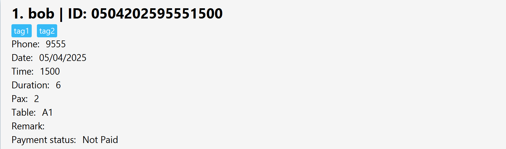
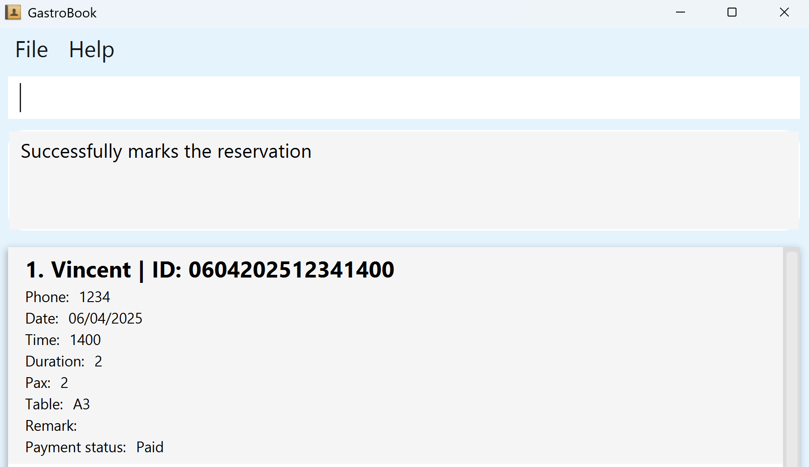
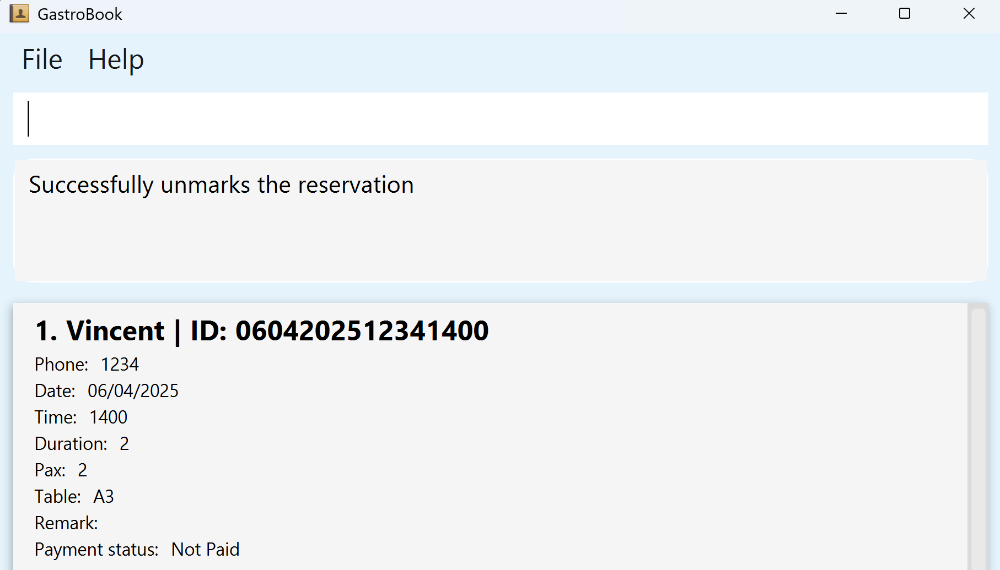
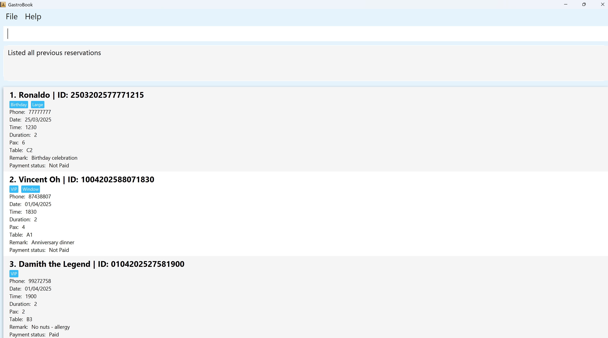
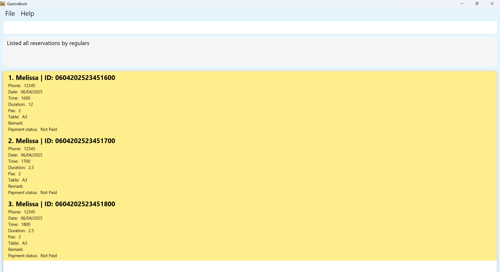
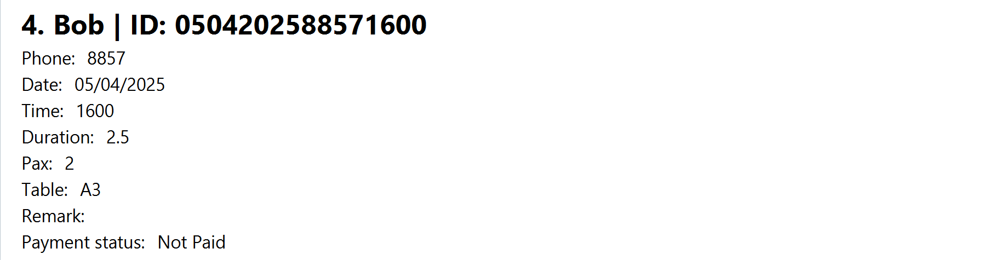

## Table of Contents

- [Introduction](#introduction)
- [Quick start](#quick-start)
- [Input Field Table](#input-field-table)
- [Design decision](#design-decision)
- [Features](#features)
  - [Viewing help : `help`](#viewing-help--help)
  - [Adding a reservation: `add`](#adding-a-reservation-add)
  - [Editing a reservation: `edit`](#editing-a-reservation-edit)
  - [Deleting a reservation : `delete`](#deleting-a-reservation--delete)
  - [Marking a reservation as paid : `mark`](#marking-a-reservation-as-paid--mark)
  - [Unmarking a reservation as paid : `unmark`](#unmarking-a-reservation-as-paid--unmark)
  - [Remarking a reservation : `remark`](#remarking-a-reservation--remark)
  - [Listing all reservations : `list`](#listing-all-reservations--list)
  - [Listing today's reservations : `listrt`](#listing-todays-reservations--listrt)
  - [Listing tomorrow's reservations : `listrn`](#listing-tomorrows-reservations--listrn)
  - [Listing all previous reservations : `listp`](#listing-all-previous-reservations--listp)
  - [Listing all reservations by regulars : `listr`](#listing-all-reservations-by-regulars--listr)
  - [Finding reservations by name: `findn`](#finding-reservations-by-name-findn)
  - [Finding reservations by phone number: `findp`](#finding-reservations-by-phone-number-findp)
  - [Finding reservations by time: `findt`](#finding-reservations-by-time-findt)
  - [Clearing the reservations: `clear`](#clearing-the-reservations--clear)
  - [Exiting the program : `exit`](#exiting-the-program--exit)
- [Saving the data](#saving-the-data)
- [Editing the data file](#editing-the-data-file)
- [Constraints](#constraints)
- [Reminder](#reminder)
- [Command summary](#command-summary)


--------------------------------------------------------------------------------------------------------------------

## Introduction

GastroBook is a **desktop application designed for small to medium scale restaurant reservation management, specifically tailored for less tech-savvy users who are proficient with the Command Line Interface (CLI). It allows for efficient call-in reservations for the current and next day, combining the simplicity of CLI usage with the advantages of a Graphical User Interface (GUI).**

--------------------------------------------------------------------------------------------------------------------

## **Quick start**

### 1. **Install Java (if you don’t have it already)**

To use **GastroBook**, you’ll need **Java 17** installed on your computer. If you're not sure whether you have it yet, don’t worry — here’s how you can check and install it!

#### 1.1 **For Mac Users**:
- Follow this easy guide to install **Java 17** on your Mac:  
  [Java Installation Guide for Mac](https://se-education.org/guides/tutorials/javaInstallationMac.html)

#### 1.2 **For Windows Users**:
- You can download and install **Java 17** from the official Oracle website:  
  [Download Java 17](https://www.oracle.com/java/technologies/downloads/#java17?er=221886)
- Just make sure to choose **Java 17** or a later version.

#### 1.3 **Not Sure Which Version You Have?**
- If you're unsure whether Java is already installed or which version you have, you can check it by opening your Command Prompt or Terminal and typing:
  ```bash
  java -version
  ```
- If you see something like **`java version "17.x.x"`**, you're good to go! If not, just follow the download links above to install the right version.

:bulb: **Note:** Information related to Java 17.

<div markdown="block" class="alert alert-info">

**:information_source: Notes: What is Java 17?**<br>

* Java 17 is a version of the Java programming language. It’s the latest stable version, offering improvements in performance, security, and new features. It’s the version required to run applications like GastroBook.

</div>

### 2. **Download the Latest `GastroBook` File**
- Visit our [GitHub page](https://github.com/AY2425S2-CS2103T-T09-3/tp) and download the most recent `.jar` file for `GastroBook`.


### 3. **Copy the file**
- First, download the **gastrobook.jar** file and **copy** it to the folder where you want to keep the app. This will be your **home folder** for GastroBook.


### 4. **Open the Command Prompt**
- On **Windows**:
  - Press the **Windows key** + **R**, type `cmd`, and press **Enter** to open the **Command Prompt**.


- On **Mac OS**:
  - Open the **Terminal** application (you can find it by searching in Spotlight or under Applications > Utilities).


### 5. **Go to the folder with the file**
- In the Command Prompt or Terminal, you'll need to "go to" the folder that contains **gastrobook.jar**.

- To do this, type the following command:


- **For Windows**:
  ```bash
  cd C:\Users\YourName\Downloads
  ```

- **For Mac OS**:
  ```bash
  cd /Users/YourName/Downloads
  ```


### 7. **Using the app**
- Upon launching the app, you'll see a command box where you can type commands and press **Enter** to execute them.
  


- **Example command**: Type `help` and press **Enter** to see a list of useful commands.

Here are some commands you can try:
- `list` – Shows all reservations for today and tomorrow.
- `listrt` – Shows all reservations for today only.
- `listp` – Shows all past reservations (from the day before).
- `exit` – Closes the application.

### 6. **Features Details**
- Refer to the [Features](#features) below for details of each command.

### Need Help?
If you encounter any problems, don't worry! Just reach out to us via our phone number `88574167`, and we'll be happy to assist you.


--------------------------------------------------------------------------------------------------------------------


## Input Field Table

| **Field**          | **Example**           | **Description**                                                           | **Restriction**                                                                                                         |
|--------------------|-----------------------|---------------------------------------------------------------------------|-------------------------------------------------------------------------------------------------------------------------|
| `NAME`             | n/John                | Name of the person making the reservation (e.g., `John`)                  | Names should only contain printable Unicode-Characters, and length must be at least 1 and at most 50                    |
| `PHONE_NUMBER`     | p/98765432            | Contact number of the person (e.g., `12345`)                              | Phone must be of numeric only and length must be at least 4 and at most 20                                              |    
| `DATE`             | date/01/04/2025       | Date of reservation (e.g., `01/03/2025`)                                  | Date must be of today or tomorrow only in the format of dd/MM/yyyy                                                      |
| `TIME`             | time/1200             | Time of reservation (e.g., `1800` for 6:00 PM)                            | Time must be of 24 hour format in the form of HHMM                                                                      |  
| `DURATION`         | duration/2            | Duration in hours (e.g., `0.5` for 30 minutes or `1` for 1 hour)          | Duration must be a floating-point value and in the form of an hour or half an hour interval, at least 0.5 and at most 12 |    
| `NUMBER_OF_PEOPLE` | pax/2                 | Number of people included in the reservation    (e.g., `10`)              | Pax number must be of numeric only, at least 1 and at most 9999                                                         |
| `TABLE_NUMBER`     | table/A1              | Assigned table number (e.g., `A2`)                                        | Table number must be in the form of 1 uppercase English letter followed by 1-3 digits                                   |
| `REMARK`           | r/Allergic to Peanuts | Any additional remarks about the reservation (e.g., `Likes cheese` )      | Remark must be of alphanumeric only and length must be at least 1 and at most 30                                        |
| `TAG`              | t/event               | Tags to categorize the reservation (e.g., `regular`, `birthday`, `event`) | Tag must be of alphanumeric only and length must be at least 1 and at most 15                                           |

## Design decision

:bulb: **Note:** Information related to `RESERVATION_ID`.

<div markdown="block" class="alert alert-info">

**:information_source: Notes: Info of `RESERVATION_ID`:**<br>

* A unique `RESERVATION_ID` will be auto-generated by the system upon adding, `add` a reservation into the system.


* `RESERVATION_ID` is made up of date of reservation + last 4 digits of phone number + time of reservation.


* The `RESERVATION_ID` is displayed in a reservation card and begins after the key `ID: ` <br><br>
  


* Command such as `edit`, `mark`, `unmark`, `delete`, `remark` must take in `RESERVATION_ID` as the first parameter to perform respective execution.

</div>

<div markdown="block" class="alert alert-info">

**:information_source: Justification: Usage of `RESERVATION_ID`**<br>

* After considering call-in reservations, using a `RESERVATION_ID` of unique combinations allows admin to easily retrieve reservation details by simply asking the customer for the date of reservation, the last 4 digits of their phone number, and the time of reservation. This avoids the need for admin to go through a long list or index of reservations, especially during peak hours. It streamlines the search process, minimizes wait time, and reduces potential human errors. Additionally, a well-structured and unique `RESERVATION_ID` can enhance the system's efficiency and make future referencing or modifications much more convenient.


* Even though the `RESERVATION_ID` is 16 characters long, it remains manageable—especially for users who are comfortable with fast typing in the Command Line Interface (CLI). This design caters to power users, allowing them to make quick edits or add remarks with minimal friction, streamlining the overall user experience.

</div>


## Features
:bulb: **Note:** Parameters with brackets (`[]`) are optional and need not be included if not needed.

<div markdown="block" class="alert alert-info">

**:information_source: Notes about the command format:**<br>

* Words in `UPPER_CASE` are the parameters to be supplied by the user.<br>
  e.g. in `add n/NAME`, `NAME` is a parameter which can be used as `add n/John`.

* Items in square brackets are optional.<br>

* Items with `…`​ after them can be used multiple times including zero times.<br>
  e.g. `[t/TAG]…​` can be used as ` ` (i.e. 0 times), `t/birthday`, `t/birthday t/vegeterian` etc.

* Parameters can be in any order.<br>
  e.g. if the command specifies `n/NAME p/PHONE_NUMBER`, `p/PHONE_NUMBER n/NAME` is also acceptable.

* Extraneous parameters for commands `help`, `exit` and `clear` will be ignored.<br>
  e.g. if the command specifies `help 123`, it will be interpreted as `help`.

* All commands are case-sensitive and need to be in lowercase.
</div>

### Viewing help : `help`

Shows a link to guide you to a help page.


Format: `help`

### Adding a reservation: `add`

Adds a reservation to GastroBook.

Format: `add n/NAME p/PHONE_NUMBER date/DATE time/TIME duration/DURATION pax/NUMBER_OF_PEOPLE table/TABLE_NUMBER [t/TAG_1] [t/TAG_2]...`

Examples:
* `add n/John Doe p/98765432 date/01/03/2025 time/1800 duration/2 pax/2 table/A1 t/anniversary`

Notes:
* A reservation can have any number of tags (including 0 or more).
* Can only add reservations of today or tomorrow but not past reservations.

<div markdown="block" class="alert alert-info">

**:information_source: Justification: Reliable Uniqueness Check Using Last 4 Digits of Phone Number**<br>

* A reservation with the same date, time, and last 4 digits of the phone number is considered a duplicate and will not be allowed. This is highly unlikely to occur, as the last 4 digits of a phone number are commonly used for verification in systems like banks and telecom services, ensuring uniqueness and preventing accidental duplicates.

* For instance, the Chinese robotaxi service, Luobo Kuaipao, uses the last 4 digits of a passenger's phone number as a verification method to unlock the vehicle. This is a secure and efficient way to authenticate users, leveraging the low probability of two people having the same last 4 digits. [LuoBoKuaiPao](https://www.sixthtone.com/news/1015767)

* The application gives the user full freedom in adding reservations as long as there are no duplicates, hence **organisation of reservations and resolving of table clashes will be up to the user to handle**.
</div>


### Editing a reservation: `edit`

Edits details of the reservation in GastroBook with the specified `RESERVATION_ID`.

Format: `edit RESERVATION_ID [n/NAME] [p/PHONE_NUMBER] [date/DATE] [time/TIME] [duration/DURATION] [pax/NUMBER_OF_PEOPLE] [table/TABLE_NUMBER] [t/TAG_1] [t/TAG_2]...`

Examples:
* `edit 1803202512341230 duration/1 pax/3`

Notes:
* `RESERVATION_ID` is a must specified field and can be obtained either from details given by customer via call in or the list of reservation.
* At least one of the optional fields must be provided in order to edit a reservation successfully.
* Existing values will be updated to the input values.
* When editing tags, the existing tags of the person will be removed i.e adding of tags is not cumulative.
* Remove all reservation tags by typing t/ without specifying any tags after it.
* Can only edit today or tomorrow reservations but not past reservations.


### Deleting a reservation : `delete`

Deletes a specific reservation from GastroBook with the specified `RESERVATION_ID`.

Format: `delete RESERVATION_ID`

Examples:
* `delete 1803202512341230`

Notes:
* `RESERVATION_ID` is a must specified field and can be obtained either from details given by customer via call in or the list of reservation.
* Can only delete today or tomorrow reservations but not past reservations.


### Marking a reservation as paid : `mark`

Marks a specific reservation as paid at the payment status in the reservation card with the specified `RESERVATION_ID`.

Format: `mark RESERVATION_ID`

Examples:
* `mark 1803202512341230`

* The word `Paid` is displayed in the reservation card after the key `Payment status: ` when sample `mark` command has been entered with a specified `RESERVATION_ID`.<br><br>
  

Notes:
* `RESERVATION_ID` is a must specified field and can be obtained either from details given by customer via call in or the list of reservation.
* Can only mark today or tomorrow reservations as paid but not past reservations.


### Unmarking a reservation as paid : `unmark`

Marks a specific reservation as unpaid at the payment status in the reservation card with the specified `RESERVATION_ID`.

Format: `unmark RESERVATION_ID`

Examples:
* `unmark 1803202512341230`

* The word `Not Paid` is displayed in the reservation card after the key `Payment status: ` when sample `unmark` command has been entered with a specified `RESERVATION_ID`.<br><br>
  

Notes:
* `RESERVATION_ID` is a must specified field and can be obtained either from details given by customer via call in or the list of reservation.
* Can only mark today or tomorrow reservations as unpaid but not past reservations.


### Remarking a reservation : `remark`

Adds or updates the remark int the reservation card with the specified `RESERVATION_ID`.

Format: `remark RESERVATION_ID r/REMARK`

Examples:
* `remark 1803202512341230 r/he like cheese!`.

Notes:
* Any previous remark will be overwritten with the new one.
* An empty remark can be added or updated via `remark r/`
* `RESERVATION_ID` is a must specified field and can be obtained either from details given by customer via call in or the list of reservation.
* Can only add or update the remark of today or tomorrow reservations but not past reservations.


### Listing all reservations : `list`

Shows a list of all reservations in GastroBook for today and tomorrow, sorted by date and time.

Format: `list`


### Listing today's reservations : `listrt`

Shows a list of all reservations for today, sorted by time.

Format: `listrt`


### Listing tomorrow's reservations : `listrn`

Shows a list of all reservations for tomorrow, sorted by time.

Format: `listrn`


### Listing all previous reservations : `listp`

Shows a list of all reservations made prior to the current system date (i.e., today's date in real time).

Format: `listp`

Notes:
* Below is the GUI that appears when the `listp` command is entered, displaying some sample previous reservation data that is preloaded into `gastrobook`for demonstration purposes. Upon entering `listp`, you should be able to see this displayed GUI.<br><br>
  


### Listing all reservations by regulars : `listr`

Shows a list of all reservations for today and tomorrow made by regulars.

Format: `listr`

Notes:
* Below is the GUI displayed when the `listr` command is entered. Sample data is not preloaded for this feature, but you can test it by adding reservations with the same phone number three or more times. Then, use `listr` to view the Regulars. <br><br>
  


* Yellow reservation card indicates reservation made by a regular.<br><br>
  


* White reservation card indicates reservation made by a non-regular. <br><br>
  


:bulb: **Note:** Definition of a Regular.

<div markdown="block" class="alert alert-info">

**:information_source: Who is a Regular ?**<br>

* A Regular refers to a customer who has made three or more reservations, including past reservations by adding, `add` the reservations into the system. Regulars are identified by phone number—regardless of the name used since it is possible that different family members use the same phone number for reservations. Even if different names are provided, as long as the phone number is the same, they are treated as the same entity (i.e., one regular) by the system.


* Editing, `edit` a Regular's reservation card (indicated by a yellow card) may cause all related reservation cards (booked under the same phone number) to turn white, and the customer to lose Regular status if, after the `edit`, their total number of reservations — including both past and current — falls below the threshold of 3, which is the minimum required to be considered a Regular.


* Deleting, `delete` a Regular's reservation card (indicated by a yellow card) may cause all related reservation cards (booked under the same phone number) to turn white, and the customer to lose Regular status if, after the `delete`, their total number of reservations — including both past and current — falls below the threshold of 3, which is the minimum required to be considered a Regular.

</div>


### Finding reservations by name: `findn`

Finds reservations of today and tomorrow by the specified name(s).

Format: `findn NAME [NAME_1] [NAME_2] [NAME_3] ...`

Examples:
* `findn John` returns all reservations made by John for today and tomorrow.
* `findn Jane` returns all reservations made by Jane for today and tomorrow.
* `findn John Jane` returns all reservations made by John or Jane for today and tomorrow.

Notes:
* More than one name parameter is allowed.
* The name could be first name, middle name or last name.
* The search is based on exact matching but not partial matching — either the first name, middle name or last name must match exactly for results to be displayed.
* The search is case-insensitive. e.g., `findn john doe` will match `John Doe`
* Can only search for reservations by customer name for today and tomorrow; past reservations are excluded.


### Finding reservations by phone number: `findp`

Finds reservations of today and tomorrow by the specified phone number(s).

Format: `findp PHONE_NUMBER [PHONE_NUMBER_1] [PHONE_NUMBER_2] [PHONE_NUMBER_3] ... `

Examples:
* `findp 98765432` returns all reservations made by the person with phone number 98765432 for today and tomorrow.
* `findp 91234567 98765432` returns all reservations made by the people with phone numbers 91234567 and 98765432 for today and tomorrow.

Notes:
* More than one phone number parameter is allowed.
* The search is based on exact matching but not partial matching. e.g., `9123` will not match `91234567` and only `91234567` will match for `91234567`.
* Can only search for reservations by customer phone number for today and tomorrow; past reservations are excluded.


### Finding reservations by time: `findt`

Finds reservations of today that are ongoing at the specified time.

Format: `findt TIME`

Examples:
* `findt 1400` returns all reservations scheduled for today ongoing at 2:00 PM (e.g., a reservation from 1:00 PM to 3:00 PM or 2:00 PM to 4:00 PM), but excludes reservations that end at 2:00 PM (e.g., a reservation from 1:00 PM to 2:00 PM).

Notes:
* Can only take in one time parameter.
* Can only search by time for today ongoing reservations only; past and tomorrow reservations are excluded.
* A reservation is deemed ongoing if its start time is at or before the specified time and its end time (computed as start time plus duration) is after the specified time.
* Reservations that end exactly at the specified time are not regarded as ongoing reservations.


### Clearing the reservations : `clear`

Clearing all reservations regardless of previous, today or tomorrow.

Format: `clear`


### Exiting the program : `exit`

Exits the program.

Format: `exit`


### Saving the data

GastroBook data are saved in the hard disk automatically after any command that changes the data. There is no need to save manually.


### Editing the data file

GastroBook data are saved automatically as a JSON file `[JAR file location]/data/gastrobook.json`.

--------------------------------------------------------------------------------------------------------------------

## Constraints
1. The threshold for a customer to be classified as a Regular is currently hardcoded at 3 reservations. Future refinements will depend on the customer base served.

2. All fields are fixed.

3. Identification of reservation is unique and it is auto-generated by system. Editing, `edit` the last 4 digits of the phone number or the reservation date or time, will result in a change to the `RESERVATION_ID` accordingly.

4. Last 4 digits of a phone number entered to the system must be unique. For example, if "1234" is already in the system, "12341234" will not be allowed by the system, as the probability of such a duplication of last 4 digits of phone number occurring in real life is extremely low.

5. Guest records will still be present in persons list for history purposes even after clearing, `clear` the reservations. Thus, the reservation card will still change their color accordingly to indicate whether the guest is a regular or non-regular based on the unclear past reservation counts records in the persons list.

6. `add` and `edit` features are not able to modify if a reservation is paid or unpaid.

7. `add` and `edit` features are not able to modify the remark of a reservation

8. The system does not handle table clashes automatically; it is up to the admin's discretion and knowledge to manage overlapping reservations.

9. Editing tags will overwrite the existing ones, so you will need to add the previous tags back before adding new ones.

10. The only way to delete a remark of reservation in the system is by using `remark r/` which is to set the remark to null.

--------------------------------------------------------------------------------------------------------------------

## Reminder
1. For compatibility reasons, avoid copying commands directly from the User Guide PDF into the command window for testing purposes. This may lead to errors or unexpected behavior since this is a real-time system.

2. Since the `RESERVATION_ID` is defined based on the reservation date + the last 4 digits of the phone number + reservation time, duplication checks are performed using this combination rather than the customer's name or phone number alone.

3. This is essential for understanding how Regulars are defined: a customer with the same phone number but different names is considered the same entity, while a different phone number (even with the same name) or a different phone number and name pair will be treated as separate entities in the persons list.

4. Do not overwrite or replace the data in  `gastrobook.json` and `personslist.json` files under `/data` directory directly to avoid unexpected behavior and ensure the system can read them properly. Overwriting these files may result in lost records and prevent the system from booting correctly, causing reservation data to not display properly. Instead, follow the normal procedure to input data so that it is properly recorded into the `gastrobook.json` and `personslist.json` files.

5. Each time `gastrobook` is loaded, only today’s reservations are displayed, provided the data for today's reservations has already been entered. This supports efficient service and preparation. The GUI is identical to `listrt`.

6. The preloaded past sample reservation data shown when `listp` is entered is solely for demo purposes and does not have corresponding reservation counts in `personslist.json`.

7. It is recommended to use `clear` to remove all past sample reservation data to start fresh as a user after running `listp` to get a grasp of what `listp` does when you first use `gastrobook`.

8. After using `clear`, the past sample reservation data will be removed completely and cannot be retrieved back.

--------------------------------------------------------------------------------------------------------------------

## Command summary

| Action                   | Format, Examples                                                                                                                                                                                                                                                                 |
|--------------------------|----------------------------------------------------------------------------------------------------------------------------------------------------------------------------------------------------------------------------------------------------------------------------------|
| **Add**                  | `add n/NAME p/PHONE_NUMBER date/DATE time/TIME duration/DURATION pax/NUMBER_OF_PEOPLE table/TABLE_NUMBER [t/TAG]... ` <br> e.g., `add n/John Doe p/98765432 date/01/03/2025 time/1800 duration/2 pax/2 table/A1 t/regular t/event`                                               |
| **Edit**                 | `edit RESERVATION_ID [n/NAME] [p/PHONE_NUMBER] [date/DATE] [time/TIME] [duration/DURATION] [pax/NUMBER_OF_PEOPLE] [table/TABLE_NUMBER] [t/TAG]...` <br> e.g.,`edit 1803202512341200 n/John Doe p/98761234 date/18/03/2025 time/1800 duration/2 pax/2 table/A1 t/regular t/event` |
| **Delete**               | `delete RESERVATION_ID`<br> e.g., `delete 1803202512341200`                                                                                                                                                                                                                      |
| **Mark**                 | `mark RESERVATION_ID`<br> e.g., `mark 1803202512341200`                                                                                                                                                                                                                          |                                                                                                                                                                                                                                                                   |
| **Unmark**               | `unmark RESERVATION_ID`<br> e.g., `unmark 1803202512341200`                                                                                                                                                                                                                      |
| **Remark**               | `remark RESERVATION_ID r/REMARK`<br> e.g., `remark 1803202512341200 r/he like cheese!`                                                                                                                                                                                           |
| **Find by name**         | `findn NAME [NAME_1] [NAME_2] ...`<br> e.g., `findn John Doe`                                                                                                                                                                                                                    |
| **Find by phone number** | `findp PHONE_NUMBER [PHONE_NUMBER_1] [PHONE_NUMBER_2] ...`<br> e.g., `findp 91234567`                                                                                                                                                                                            |
| **Find by time**         | `findt TIME`<br> e.g., `findt 1400`                                                                                                                                                                                                                                              |
| **List all**             | `list`                                                                                                                                                                                                                                                                           |
| **List today**           | `listrt`                                                                                                                                                                                                                                                                         |
| **List tomorrow**        | `listrn`                                                                                                                                                                                                                                                                         |
| **List previous**        | `listp`                                                                                                                                                                                                                                                                          |
| **List regulars**        | `listr`                                                                                                                                                                                                                                                                          |
| **Clear**                | `clear`                                                                                                                                                                                                                                                                          |
| **Help**                 | `help`                                                                                                                                                                                                                                                                           |                                                                                                                                                                                                                                                                   |
| **Exit**                 | `exit`                                                                                                                                                                                                                                                                           |
